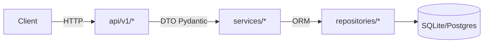
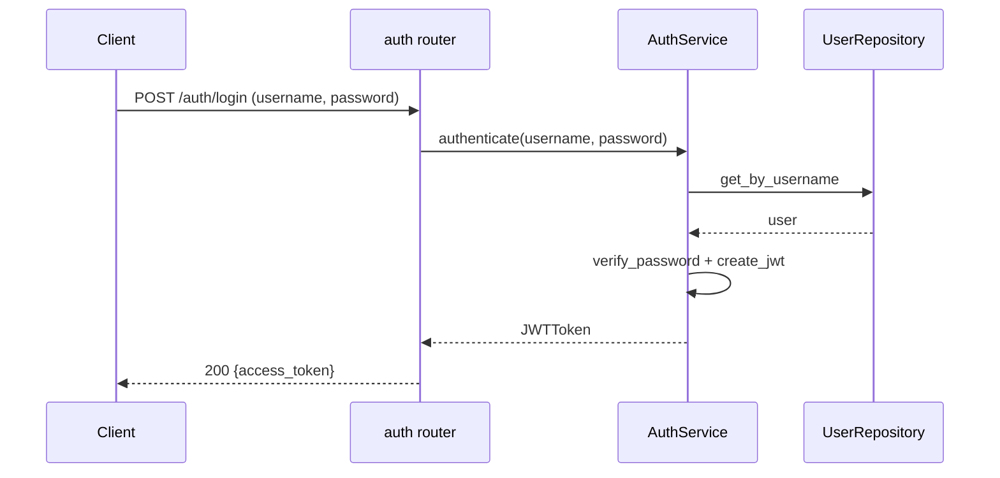

# Architecture — todo-api

## 1. 개요

FastAPI 기반의 레이어드 아키텍처. 의존성 주입으로 라우터→서비스→리포지토리→DB 순으로 호출한다.

## 2. 디렉터리 레이아웃

```
app/
├── main.py               # FastAPI 앱 팩토리 (create_app)
├── api/
│   ├── __init__.py
│   ├── deps.py           # 공통 Depends (DB 세션, 현재 사용자)
│   ├── v1/
│   │   ├── __init__.py
│   │   ├── todos.py      # /api/v1/todos/*
│   │   ├── auth.py       # /api/v1/auth/* (task-2부터)
│   │   └── users.py      # /api/v1/users/* (task-2부터)
├── services/
│   ├── __init__.py
│   ├── todo_service.py
│   ├── auth_service.py   # task-2부터
│   └── user_service.py   # task-2부터
├── repositories/
│   ├── __init__.py
│   ├── todo_repository.py
│   └── user_repository.py  # task-2부터
├── models/
│   ├── __init__.py
│   ├── base.py           # DeclarativeBase
│   ├── todo.py
│   └── user.py           # task-2부터
├── schemas/
│   ├── __init__.py
│   ├── todo.py
│   ├── auth.py           # task-2부터
│   └── user.py           # task-2부터
└── core/
    ├── __init__.py
    ├── config.py         # Pydantic BaseSettings
    ├── db.py             # engine, SessionLocal, get_db
    ├── security.py       # JWT 발급/검증, 비밀번호 해시
    └── logging.py        # 로거 구성
```

## 3. 레이어 책임

| 레이어 | 책임 | 금지 |
|---|---|---|
| **api** | HTTP 표현, 입력 검증, HTTPException 매핑 | ORM 직접 사용, 비즈니스 로직 |
| **services** | 비즈니스 규칙, 트랜잭션 경계 | HTTPException, HTTP 세부 사항 |
| **repositories** | CRUD, 쿼리 최적화 | 비즈니스 규칙 |
| **models** | SQLAlchemy ORM 정의 | 쿼리, 서비스 호출 |
| **schemas** | Pydantic I/O DTO | DB 접근 |
| **core** | 설정, 공통 인프라 | 도메인 지식 |

## 4. 컴포넌트 다이어그램



## 5. 인증 흐름 (task-2부터)



## 6. 페이지네이션 규약 (task-3부터)

- 쿼리 파라미터: `?page=1&size=20&q=검색어&completed=true`
- 응답 스키마:

```json
{
  "items": [...],
  "total": 120,
  "page": 1,
  "size": 20
}
```

- `size` 최대 100, 기본 20. 초과 시 422.

## 7. 에러 응답 형식

```json
{
  "detail": "Todo not found",
  "code": "TODO_NOT_FOUND"
}
```

## 8. 설정 (Pydantic Settings)

- `APP_ENV` (dev/test/prod)
- `DATABASE_URL` (기본: `sqlite:///./data.db`)
- `JWT_SECRET`, `JWT_ALGORITHM=HS256`, `JWT_EXPIRE_MINUTES=60`
- `LOG_LEVEL=INFO`

## 9. 확장성/제약

- 멀티프로세스 워커 금지 (user rule 11: Windows num_workers>0 이슈).
  `uvicorn --workers 1` 권장.
- 단일 SQLite로 테스트, 운영은 PG를 가정하지만 본 실험에선 SQLite 사용.

## 10. 참고

- FastAPI 공식 문서: https://fastapi.tiangolo.com/
- SQLAlchemy 2.x Async 패턴 (본 실험에서는 sync로 진행)
