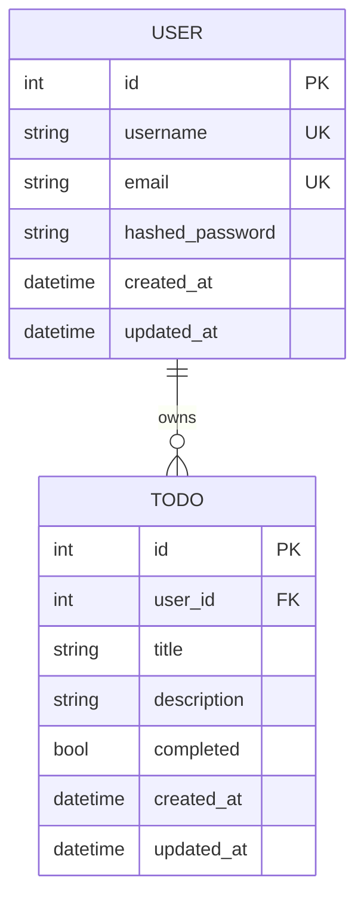

# Database Schema — todo-api

> SQLAlchemy 2.x DeclarativeBase 기반. SQLite 개발/테스트, PostgreSQL 운영 호환.

## 1. 엔터티 다이어그램

## 2. 테이블 정의

### 2.1 `todos` (task-1부터)

| 컬럼 | 타입 | 제약 | 비고 |
|---|---|---|---|
| id | INTEGER | PK, autoincrement | |
| title | VARCHAR(200) | NOT NULL | 1..200자 |
| description | TEXT | NULL | 선택 |
| completed | BOOLEAN | NOT NULL, default=false | |
| user_id | INTEGER | FK users.id, NOT NULL (task-2부터) | task-1에서는 nullable |
| created_at | DATETIME | NOT NULL, default=now() | |
| updated_at | DATETIME | NOT NULL, onupdate=now() | |

**인덱스**:
- `idx_todos_user_id` on (user_id) — task-2부터
- `idx_todos_title_trgm` — task-3부터 SQLite는 `LIKE` 사용, Postgres는 trigram 인덱스 권장

### 2.2 `users` (task-2부터)

| 컬럼 | 타입 | 제약 | 비고 |
|---|---|---|---|
| id | INTEGER | PK, autoincrement | |
| username | VARCHAR(30) | UNIQUE, NOT NULL | 3..30자 |
| email | VARCHAR(254) | UNIQUE, NOT NULL | RFC 5322 |
| hashed_password | VARCHAR(255) | NOT NULL | bcrypt |
| created_at | DATETIME | NOT NULL, default=now() | |
| updated_at | DATETIME | NOT NULL, onupdate=now() | |

**인덱스**:
- `uq_users_username`, `uq_users_email`

## 3. 관계

- `users.id` ← `todos.user_id` (1:N)
- task-2에서 `todos.user_id`는 NOT NULL로 전환.
  - task-1 단계에서 작성된 TODO는 "마이그레이션 시 기본 사용자에 귀속" 또는 "초기화" 중 택일.
  - 본 실험에서는 task-2 시작 시 DB를 **초기화**한다.

## 4. 기본값/시간 관리

- `created_at` / `updated_at`은 SQLAlchemy `default=datetime.utcnow`와 `onupdate=datetime.utcnow`로 관리.
- UTC 기준.

## 5. 마이그레이션

- 본 실험에서는 Alembic **선택**. 단순성을 위해 `Base.metadata.create_all` 사용 가능.
- task-2 시작 시 `data.db` 파일 삭제 후 재생성.

## 6. 테스트 DB

- in-memory SQLite (`sqlite:///:memory:`)로 pytest fixture에서 매 테스트 격리.
- fixture 예시는 `tests/conftest.py` 참고.

## 7. 설정

- `DATABASE_URL` env로 주입. 기본값: `sqlite:///./data.db`.
- Pydantic `BaseSettings`로 노출.
