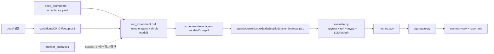

# 참조 문서 구조에 따른 LLM 기반 코드 생성 결과 양상 비교 — 실험 계획서 (v1)

- 작성일: 2026-04-21
- 버전: v1
- 작성자: (프로젝트 오너)
- 본 문서는 자동화 실험의 전체 설계도이며, 실행은 `experiments/runner/*` 스크립트가 수행한다.

---

## 1. 연구 배경 및 목적

LLM/에이전트 기반 코딩이 일반화되면서, "한 번 프롬프트"가 아니라 **`docs/` 계층 문서 + `AGENTS.md` 같은 전역 지침 + 진행상황 문서**를 지속적으로 참조시키는 방식이 확산 중이다. 동시에, 매 세션마다 동일한 교정을 반복해야 하는 피로도 역시 크다.

본 연구는 **문서 참조 방식의 차이가 코드 생성 결과의 (a) 완성도, (b) 일관성, (c) 수정 필요 정도, (d) 사용자-LLM 통신량에 미치는 영향**을 5단계 조건으로 정량 비교한다. 전통적 "개인+개인" 방법론이 아니라, **개인 + 복수 LLM 협업 관점**에서 "사용자 개입을 최소화하는 문서 구조"를 찾는 것이 목표다.

### 1.1 선행 연구 및 차별성

| 구분 | 선행 연구 (ETH Zurich, 2026.03) | 본 연구 |
|---|---|---|
| 대상 | AGENTbench (138 repo) | Greenfield FastAPI 1개 + (선택) SWE-bench Lite 3~5 repo |
| 변수 | AGENTS.md **유/무** (+ 작성 주체) | AGENTS.md 포함 **문서 구조 5단계(C0~C4)** |
| 주 지표 | 성공률(%) + 비용(step/token) | 8개 지표 (본 계획 §6.3) |
| 새 요소 | — | `continual-learning` 플러그인 기반 **자동 유지(C4)** |
| 참고 | [InfoQ 요약](https://www.infoq.com/news/2026/03/agents-context-file-value-review/) | — |

> 선행 연구의 결과(LLM 생성 AGENTS.md는 -3% 성공률, 인간 작성은 +4%)는 **유/무 이분법**에서 도출된 것이며, 실무에서 실제로 쓰이는 "문서 구조의 계층성/분할성/자동유지" 변수는 다루지 않았다. 본 연구는 그 공백을 채운다.

### 1.2 용어

- **조건(condition)**: 워크스페이스에 제공되는 문서 구성 방식. `C0` ~ `C4` (§3).
- **task**: LLM에 전달되는 단일 구현 요청. Phase 1에서는 3개 연속 task (§4.1).
- **run**: `(task, condition, model, rep)` 조합 1회의 end-to-end 실행.
- **judge**: 정성 지표 채점용 LLM (고정 모델 사용).

---

## 2. 가설

- **H1 (계층화 효과)**: C2(분할) → C3(계층+AGENTS) 순으로 **요구사항 충족률**과 **설계-구현 일치도**가 증가한다.
- **H2 (통신량 vs 내부 비용 트레이드오프)**: 문서량이 늘수록 **재프롬프트 횟수(사용자 개입)는 감소**하나, **에이전트 step 수(내부 탐색)는 증가** 경향을 보인다. (ETH 연구와 일관)
- **H3 (자동 유지 효과)**: C4는 연속 task 시나리오에서 **2번째·3번째 task의 "이전 task에서 정한 규칙 재교정 횟수"가 C3 대비 유의하게 감소**한다.
- **H4 (한계)**: 문서 크기가 과도한 조건(C3/C4)은 단순한 task에서 오히려 토큰·시간 비용 증가로 ROI가 낮을 수 있다.

---

## 3. 실험 조건 (5단계)

| ID | 이름 | 제공 문서 |
|---|---|---|
| **C0** | Bare | (없음) 요청 프롬프트만 |
| **C1** | SingleReq | `requirements.md` 1개 파일 |
| **C2** | Split | `requirements.md` + `architecture.md` + `api.md` + `db.md` |
| **C3** | StructuredDocs | C2의 4개 파일 + `docs/` 계층(ADR, 진행상황) + 루트 `AGENTS.md`(스타일/명령어/테스트 룰) |
| **C4** | ContinualDocs | C3 + `continual-learning` 플러그인 활성화 → 세션 간 AGENTS.md 자동 업데이트 |

- C2 분할 기준은 전형적 SaaS 스택 설계서 구분: 요구사항 / 아키텍처 / API 명세 / DB 스키마.
- C3 계층은 [Cursor Rules 문서](https://cursor.com/docs/context/rules)의 "AGENTS.md + nested" 권장안을 따른다.
- C4의 `continual-learning`은 Cursor 공개 플러그인 (`/add-plugin continual-learning`). transcript의 증분을 mining하여 `AGENTS.md`의 "Learned User Preferences / Learned Workspace Facts" 섹션을 자동 업데이트한다.

### 3.1 Task 1개만으로는 C4 효과 부족 → "연속 3 task"

C4의 핵심은 **세션 간 학습**이므로 단일 task로는 측정이 불가능하다. 본 실험은 Phase 1에서 **3개 연속 task**를 순서대로 수행한다 (§4.1). C0~C3도 동일한 3 task를 동일 순서로 수행하여 공정성을 확보한다.

---

## 4. 실험 대상 — Hybrid (Greenfield → Brownfield)

### 4.1 Phase 1 (Greenfield) — 파일럿 + 본실험

- **도메인**: Python FastAPI 기반 **TODO API**
- **선정 이유**:
  - 난이도 중(단순 CRUD ~ 인증/필터까지 scaling)
  - 실행·테스트 자동화 용이 (pytest + httpx)
  - 정적 분석 적용 쉬움 (ruff, mypy)
  - 공개 벤치마크(HumanEval/MBPP)와 달리 LLM 훈련 데이터에 포함될 가능성이 낮은 **내부 커스텀** task.

- **연속 3 task**:
  1. **task-1-todo-crud**: 기본 CRUD + SQLite + 입력 검증
  2. **task-2-jwt**: JWT 인증 + 사용자 관리 추가
  3. **task-3-pagination**: 페이지네이션 + 검색 필터 추가

- **공통 품질 게이트**:
  - pytest coverage ≥ 70%
  - ruff 에러 0
  - mypy 에러 ≤ 3 (일부 타입 유연성 허용)

### 4.2 Phase 2 (Brownfield, 선택적 확장)

- **데이터셋**: [SWE-bench Lite](https://www.swebench.com/SWE-bench/) 또는 [SWE-bench Verified](https://www.swebench.com/SWE-bench/)에서 3~5개 task 샘플링
- **이유**: 실무에서 더 흔한 "기존 repo + 이슈" 시나리오 검증
- **참고 구현**: [Aider SWE-bench harness](https://github.com/Aider-AI/aider-swe-bench) 구조 차용 (`harness.py` + Docker)
- **착수 조건**: Phase 1 결과 조건 간 차이가 p<0.1에서 유의하거나, 특정 가설(H1, H3)이 직관적으로 관찰될 때. 판단 기준은 `docs/phase2_decision_checklist.md` 참고.

---

## 5. 에이전트/모델 정책 — 단일 (agent, model) 독립 실행

### 5.1 정책: 한 번에 한 (agent, model) 만

**여러 모델을 같이 돌리면** (a) 토큰/크레딧 비용 통제가 어렵고 (b) 환경/부하가 얽혀 분산이 커지며 (c) Cursor 한 곳에 종속됩니다. 본 실험은 그래서 **한 번의 실행 = 하나의 (agent, model)** 로 제한합니다. 대신 아래 세 가지 방법으로 "여러 구독의 잔여 토큰을 분산 소진"합니다.

1. **RunId 공유**: 같은 `-RunId <id>` 를 여러 번 호출하면, 같은 `results/<id>/` 아래 `<agent>/<model>/` 로 결과가 누적되고 `aggregate.py` 가 교차 집계합니다.
2. **Agent adapter 레이어**: `experiments/runner/agents/<agent>.ps1` 어댑터를 통해 Cursor/Codex/Aider/Copilot/custom/manual 을 CLI 진입점만 바꿔 동일하게 다룹니다. (`agents/README.md`)
3. **Quota monitor**: `monitor_quota.ps1` 가 실행 실패율과 시간 예산을 감시해 자동 중단합니다.

### 5.2 어댑터 매핑

| Agent | CLI | 모델명 예 | 메모 |
|---|---|---|---|
| `cursor`  | `cursor-agent -p --force --model <M> --output-format stream-json` | `sonnet`, `gpt-5`, `composer` | 가장 안정적 |
| `codex`   | `codex exec --model <M> --json` (OpenAI Codex CLI) | `gpt-4o`, `gpt-5-codex` | OPENAI_API_KEY 필요 |
| `aider`   | `aider --model <M> --yes --no-pretty --message-file <prompt>` | `openai/gpt-4o-mini`, `anthropic/claude-3-7-sonnet-*` | `pip install aider-chat` |
| `copilot` | `gh copilot suggest -t shell "<prompt>"` (제한적) | `copilot` | 코드 수정 불가 → 보통 `manual` 권장 |
| `custom`  | 사용자가 `-CustomCmd` 로 임의 CLI 템플릿 주입 | 임의 | `${WORKSPACE}`, `${PROMPT_FILE}`, `${MODEL}`, `${STREAM_OUT}` 치환 |
| `manual`  | 워크스페이스만 준비, 사람이 IDE 대화형 실행 후 Enter | 임의 | Copilot Chat GUI 등 |

### 5.3 run 매트릭스 크기 (한 (agent, model) 기준)

```
5 조건 × 3 반복 × 3 task = 45 run / (agent, model)
+ C4 는 rep 당 3 task 가 같은 workspace 에서 연속 실행되므로 workspace 9 개 / (agent, model)
```

여러 (agent, model) 을 수행하려면 같은 `RunId` 로 runner 를 반복 호출하면 됩니다:

```powershell
$id = (Get-Date -Format 'yyyyMMdd_HHmmss')
.\experiments\runner\run_experiment.ps1 -RunId $id -Agent cursor -Model sonnet      -Repeats 3
.\experiments\runner\run_experiment.ps1 -RunId $id -Agent cursor -Model gpt-5       -Repeats 3
.\experiments\runner\run_experiment.ps1 -RunId $id -Agent aider  -Model "openai/gpt-4o-mini" -Repeats 3
.\experiments\runner\run_experiment.ps1 -RunId $id -Agent codex  -Model "gpt-5-codex" -Repeats 3
# (필요 시) Copilot GUI 는 수동 모드로
.\experiments\runner\run_experiment.ps1 -RunId $id -Agent manual -Model "copilot-gui-claude" -Repeats 1
```

마지막 호출 후 `results/$id/report.md` 에 **agent × model × condition** 교차 리포트가 생성됩니다.

---

## 6. 자동화 파이프라인

### 6.1 전체 아키텍처



### 6.2 디렉터리 매핑 (본 레포 기준)

```
docs_experiment/
├─ docs/                       # "문서 원본" — 조건 C2~C4가 참조
│  ├─ 실험계획서_20260421_v1.md (본 문서)
│  ├─ AGENTS.md                # C3/C4 전역 지침
│  ├─ architecture.md          # C2/C3/C4
│  ├─ api.md                   # C2/C3/C4
│  ├─ db.md                    # C2/C3/C4
│  ├─ adr/                     # C3/C4
│  └─ 요구사항/
│     ├─ task-1-todo-crud.md   # C1~C4에서 REQUIREMENTS.md로 복사
│     ├─ task-2-jwt.md
│     └─ task-3-pagination.md
├─ experiments/
│  ├─ conditions/C0..C4/setup.ps1   # 각 조건이 workspace에 어떤 문서를 복사할지
│  ├─ prompts/
│  │  ├─ seed_prompt.md             # 5개 조건 공용 요청 프롬프트
│  │  ├─ acceptance.task-1-todo-crud.yaml   # task별 채점 체크리스트
│  │  ├─ acceptance.task-2-jwt.yaml
│  │  ├─ acceptance.task-3-pagination.yaml
│  │  └─ judge_rubric.md
│  ├─ runner/
│  │  ├─ run_experiment.ps1         # 오케스트레이터 (단일 agent/model)
│  │  ├─ evaluate.py                # 8개 지표 산출
│  │  ├─ aggregate.py               # summary.csv + report.md
│  │  ├─ monitor_quota.ps1          # 시간/실패율 감시 (다중 subscription 공용)
│  │  ├─ agents/                    # 에이전트 어댑터 레이어
│  │  │  ├─ README.md
│  │  │  ├─ _common.ps1
│  │  │  ├─ cursor.ps1
│  │  │  ├─ codex.ps1
│  │  │  ├─ aider.ps1
│  │  │  ├─ copilot.ps1
│  │  │  ├─ custom.ps1
│  │  │  └─ manual.ps1
│  │  └─ lib/                       # 공용 Python 헬퍼
│  │     ├─ __init__.py
│  │     ├─ logger.py               # 구조화 로깅 (user rule 4)
│  │     ├─ judge.py                # LLM judge 래퍼
│  │     ├─ metrics.py              # 8개 지표 계산 함수
│  │     └─ stream_parser.py        # agent stream-json 파서 (generic)
│  ├─ results/<RunId>/<agent>/<model>/<cond>/rep<N>/<task>/
│  └─ ws/<agent>-<model>-<cond>-rep<N>/
└─ .cursor/                        # C4 전용 (continual-learning 상태)
```

### 6.3 8개 지표 → 수집 방식 매핑

| # | 지표 | 수집 방식 | 자동화 난도 |
|---|---|---|---|
| 1 | **요구사항 충족률** | `acceptance.<task>.yaml` 체크리스트를 LLM-judge에 주어 0..1 채점 | ★★ (judge 안정성 필요) |
| 2 | **테스트 통과율** | `pytest --json-report`의 `passed / total` | ★ |
| 3 | **빌드 성공 여부** | `python -m build` 또는 `uv sync` 반환 코드 | ★ |
| 4 | **설계-구현 일치도** | `architecture.md` 모듈/엔드포인트 목록 vs 실제 파일/라우트 diff → judge로 rubric 채점 | ★★★ |
| 5 | **정적 분석 오류 수** | `ruff check . --output-format=json` + `mypy --output=json` | ★ |
| 6 | **재프롬프트 횟수** | stream-json의 `user turn` 이벤트 수. 헤드리스는 보통 1. **Codex 수동 세션은 별도 카운트** | ★ |
| 7 | **수동 수정 횟수** | `--force`로 자동 실행하므로 0. 대신 `apply-failed retry`, `tool error recovered` 이벤트 수로 대체 | ★★ |
| 8 | **전체 작업 시간** | wall-clock + agent step 수 + 토큰 사용량 (stream-json) | ★ |

> **지표 4의 채점 신뢰성**을 위해 rubric을 5개 항목 × 0/1로 구체화하여 judge의 prompt에 고정 삽입 (`experiments/prompts/judge_rubric.md`).

### 6.4 단일 run 흐름 (실제 구현)

`run_experiment.ps1` 은 `-Agent`, `-Model` 을 고정한 뒤 내부에서 다음을 수행합니다.

```powershell
param($Agent, $Model, $cond, $task, $rep, $runRoot)

$wsPath = "experiments/ws/$Agent-$Model-$cond-rep$rep"
$runDir = "$runRoot/$Agent/$Model/$cond/rep$rep/$task"

# 1) 조건별 workspace 세팅 (필요한 문서만 복사)
& "experiments/conditions/$cond/setup.ps1" `
    -Workspace $wsPath -TaskId $task `
    # C4 의 후속 task 는 -KeepState 로 AGENTS.md 학습 상태 유지

# 2) seed_prompt 의 <TASK_ID> 치환 + 파일로 저장
$prompt = (Get-Content "experiments/prompts/seed_prompt.md" -Raw) -replace '<TASK_ID>',$task
$prompt | Set-Content "$runDir/prompt.txt"

# 3) 어댑터 호출 (비대화형). Cursor / Codex / Aider / ... 모두 같은 인터페이스.
& "experiments/runner/agents/$Agent.ps1" `
    -Workspace $wsPath `
    -PromptFile "$runDir/prompt.txt" `
    -Model $Model `
    -StreamOut "$runDir/stream.jsonl" `
    -MetaOut "$runDir/agent.meta.json" `
    -TimeoutSec 1800

# 4) 자동 품질 게이트 (user rule 11: -p no:xdist)
Push-Location $wsPath
pytest --cov=app --json-report --json-report-file="$runDir/pytest.json" -p no:xdist
ruff check . --output-format=json > "$runDir/ruff.json"
mypy app > "$runDir/mypy.txt"
Pop-Location

# 5) 지표 수집
python experiments/runner/evaluate.py `
    --run-dir $runDir --ws $wsPath `
    --task $task --cond $cond --model $Model --agent $Agent --rep $rep `
    --repo-root (Resolve-Path .)
```

`aggregate.py` 는 `results/<RunId>/` 하위의 모든 `metrics.json` 을 찾아 `summary.csv` 와 `report.md` 를 생성합니다. `-scope "cursor/sonnet"` 등으로 부분 집계도 가능.

### 6.5 오케스트레이터 책임 분할

- `run_experiment.ps1`: 매트릭스 반복, worktree 관리, 환경 변수 관리
- `evaluate.py`: 단일 run의 원시 로그 → `metrics.json` (8개 지표)
- `aggregate.py`: 모든 `metrics.json` → `summary.csv` + `report.md`
- `monitor_quota.ps1`: 50 run마다 Cursor 대시보드 API 또는 로컬 캐시를 polling하여 `stop` 시그널 파일 생성 → runner가 다음 반복 시 중단

---

## 7. Cursor 플러그인/기능 활용 매핑

| 기능/플러그인 | 용도 | 관련 조건 |
|---|---|---|
| `cursor-agent -p --force --output-format stream-json` ([docs](https://cursor.com/docs/cli/headless)) | 헤드리스 배치 실행 | C0~C4 공통 |
| `/worktree`, `/best-of-n` ([docs](https://cursor.com/docs/configuration/worktrees)) | 조건×모델 격리 병렬 실행 (대화형 실험 시) | 전부 |
| `continual-learning` 플러그인 | `.cursor/hooks/state/continual-learning-index.json`으로 transcript 증분 index → AGENTS.md 자동 반영 | **C4 전용** |
| `cli-for-agents` 플러그인 | runner/evaluator CLI 설계 가이드라인 | 개발 시 참고 |
| `context7` 플러그인 | 최신 FastAPI/Pydantic/SQLAlchemy 문서 fetch | C3/C4에서 허용 (C0~C2는 제한) |

### 7.1 plugin 통제

공정성을 위해 C0~C2 실행 시에는 `--bare` 플래그(Claude Code의 경우) 또는 `.cursor/mcp.json` 임시 비활성화로 context7 등 외부 docs fetch 도구를 막는다. 조건 간 "문서 접근량" 변수가 오염되지 않도록 한다.

---

## 8. 재현성 / 공정성 통제

- **시드/온도 제어 불가 → 반복 3회 평균화**: Cursor CLI는 외부에서 seed/temperature 직접 제어 불가. 대신 `rep ∈ {1,2,3}`로 분산 산출.
- **프롬프트 고정**: 모든 조건은 `seed_prompt.md` + 해당 task 요구사항을 그대로 전달. 문서의 "존재 여부"만 조건별로 다르고, 프롬프트 텍스트는 동일.
- **토큰 balance 기록**: 각 조건의 "input context 크기(문서 토큰 수)"를 같이 기록해, 결과 차이가 "문서 크기 때문인지 구조 때문인지" 분리 분석할 수 있게 한다. (§10.2 분산 분석)
- **worktree 격리 + SHA 기록**: `results/runs.csv`에 commit SHA, model, condition, rep, 시간 저장.
- **Windows 멀티프로세스 이슈 회피** (user rule 11): `pytest -p no:xdist`, `num_workers=0` 고정.

---

## 9. 일정 (목표)

| 주차 | 목표 |
|---|---|
| 주 1 | 레포 스캐폴드 완료, 시드 요구사항/문서/스크립트 초안, **C0/C1 파일럿** 동작 |
| 주 2 | C2~C4 적용, `evaluate.py`/`aggregate.py` 검증, **Phase 1 본실험 수행** |
| 주 3 | 분석 + `docs/보고서_중간분석_YYYYMMDD_v1.md` |
| 주 4~ | Phase 2(brownfield) 착수 판단 및 실행 |

---

## 10. 분석 방법

### 10.1 기술 통계

- 조건별 × 모델별 8개 지표의 **평균 / 분산 / 95% CI** → `report.md` 표.
- 조건 그룹 평균의 heatmap.

### 10.2 분산 분석 (ANOVA)

- 2-way ANOVA: factor = condition, model. Interaction 항 포함.
- H1 검증: `사후 Tukey HSD`로 C2 vs C3 간 유의차 확인.
- H2 검증: `(재프롬프트 횟수, 에이전트 step 수)`의 scatter + 음의 상관 계수.
- H3 검증: C4의 task-2, task-3에서 "이전 task 규칙 재교정 이벤트"(stream-json 패턴 매칭)를 C3 대비 Wilcoxon signed-rank.

### 10.3 정성 분석

- 각 조건별 대표 run(중앙값에 가까운 rep)의 생성 diff를 샘플링해 코드 스타일 일관성, 네이밍 컨벤션, 에러 핸들링 패턴 등 정성 측면 관찰 기록.
- "문서에 없는 규약을 LLM이 임의로 도입한 사례" 케이스 스터디.

### 10.4 비용-효용 분석

- run당 (토큰 사용량 + 시간) × 평균 지표 향상도 → "ROI per document byte" 계산. H4 검증.

---

## 11. 산출물

- `docs/실험계획서_20260421_v1.md` — 본 계획 (이 파일)
- `docs/요구사항/*.md` — 고정 시드 요구사항
- `docs/AGENTS.md`, `docs/architecture.md`, `docs/api.md`, `docs/db.md`, `docs/adr/*`
- `experiments/runner/*.{ps1,py}` — 자동화 스크립트
- `experiments/results/<ts>/summary.csv` — 집계 지표
- `docs/보고서_중간분석_YYYYMMDD_v1.md` — Phase 1 완료 후
- `docs/보고서_최종_YYYYMMDD_v1.md` — Phase 1/2 통합 최종

---

## 12. 위험 요소 및 대응

| 위험 | 영향 | 대응 |
|---|---|---|
| 단일 구독(예: Cursor Pro) 요금 소진 | 실험 중단 | `monitor_quota.ps1` + 매 N run마다 체크, 배치 분할 실행. **여러 (agent, model) 을 순차 수행하여 각 구독의 잔여 크레딧만 소진** (§5.1). |
| 여러 모델 동시 실행 시 토큰/환경 혼재 | 비교 불공정, 비용 통제 불가 | **한 번에 한 (agent, model)** 만 실행. 같은 `RunId` 로 재호출하여 누적. |
| 특정 CLI 종속 (Cursor 등) | 결과의 외부 타당성 저하 | Agent adapter 레이어 (`agents/`) 로 Codex/Aider/Copilot/custom/manual 동시 지원 |
| Agent CLI 결정론 부족 | run 간 분산 증가 | 반복 3회, 중앙값 보고, 분산도 지표화 |
| LLM-judge 편향 | 지표 1, 4의 신뢰도 저하 | judge 모델을 `sonnet`으로 고정, rubric 명문화, 20% 샘플 수동 재검수 |
| 문서 크기 ≠ 구조 혼동 | 분석 해석 오류 | 각 run 의 `input_docs_bytes` 병기, 분산 분석 |
| Windows `num_workers>0` 이슈 (user rule 11) | pytest 크래시 | `-p no:xdist`, `num_workers=0` 고정 |
| C4 플러그인 학습 편향 | AGENTS.md 자동 업데이트가 후속 task에 누출 | C4 rep마다 `.cursor/hooks/state/` 초기화, 단 rep 내부의 3 task는 유지 |

---

## 13. 참고 문헌

1. **ETH Zurich AGENTbench 연구 (2026)** — `AGENTS.md` 파일의 유/무가 agent 성능에 미치는 영향 분석. LLM 생성 컨텍스트는 -3%, 개발자 작성은 +4%. [InfoQ 요약](https://www.infoq.com/news/2026/03/agents-context-file-value-review/).
2. **SWE-bench (Jimenez et al., ICLR 2024)** — 실제 GitHub 이슈 기반 LLM 코드 수정 벤치마크. [swebench.com](https://www.swebench.com/SWE-bench/).
3. **SWE-bench Verified / Pro / Multimodal** — 보강 데이터셋. 본 연구 Phase 2의 후보.
4. **Aider SWE-bench harness** — 재시도/플러그 가능 에이전트 하네스 예시. [repo](https://github.com/Aider-AI/aider-swe-bench).
5. **Cursor Rules & AGENTS.md 공식 문서** — https://cursor.com/docs/context/rules (AGENTS.md nested, project rules)
6. **Cursor Headless CLI** — https://cursor.com/docs/cli/headless (`-p --force`, stream-json)
7. **Cursor Worktrees / `/best-of-n`** — https://cursor.com/docs/configuration/worktrees
8. **Cursor Plugin: continual-learning** — AGENTS.md 자동 유지. `/add-plugin continual-learning`.
9. **Cursor Plugin: cli-for-agents** — 에이전트 친화 CLI 설계 원칙.
10. **bigcode-evaluation-harness** — HumanEval/MBPP 계열 벤치마크 프레임워크. 본 실험에서는 직접 쓰지 않지만, 메트릭 구현 참고. [repo](https://github.com/bigcode-project/bigcode-evaluation-harness).
11. **EleutherAI lm-evaluation-harness** — LLM 평가 표준 프레임워크. [repo](https://github.com/EleutherAI/lm-evaluation-harness).

---

## 14. 변경 이력

| 버전 | 날짜 | 변경 내용 | 작성자 |
|---|---|---|---|
| v1 | 2026-04-21 | 초안 작성 (Plan 기반) | AI Assistant |
